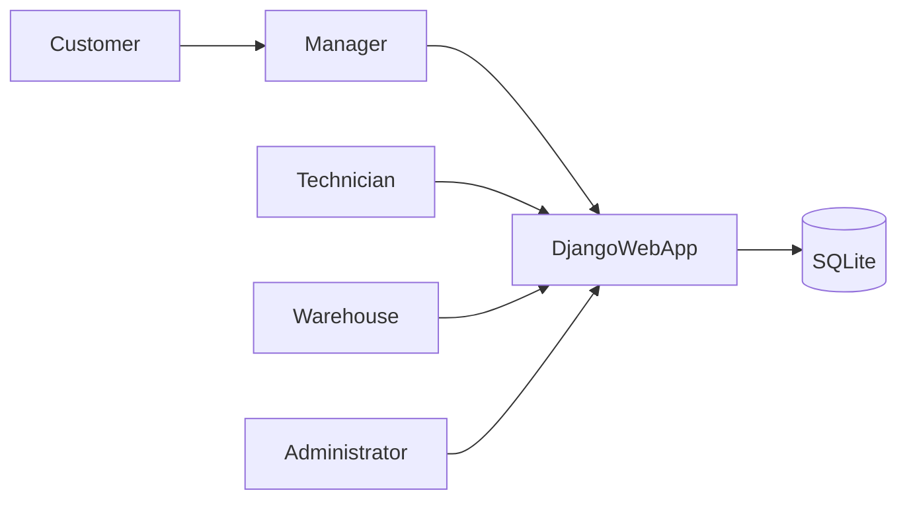
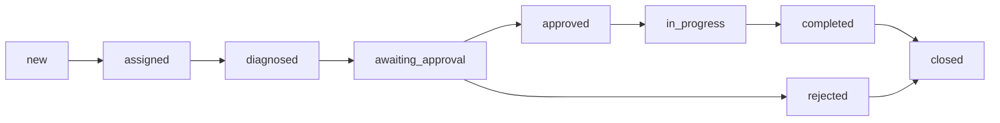

# МИНОБРНАУКИ РОССИИ
федеральное государственное бюджетное образовательное учреждение высшего образования  
«Ивановский государственный энергетический университет имени В.И. Ленина»

Кафедра информационных технологий

# ОТЧЕТ ПО ПРОЕКТУ
Дисциплина: «Управление проектами ИС»  
Тема: «Система информационной поддержки процесса ремонта техники»

Иваново, 2026

---

## Содержание
1. Описание предметной области  
2. Анализ типовых решений  
3. Требования к системе  
4. Архитектура и проектирование  
5. Реализация системы  
6. Организация работ по Scrum  
7. Тестирование  
8. Инструкция по запуску  
9. Выводы  
10. Список источников

## 1. Описание предметной области
Система предназначена для автоматизации процесса ремонта техники в сервисном центре.  
Участвующие роли:
- заказчик,
- менеджер,
- исполнитель,
- работник склада,
- администратор.

Целевой бизнес-процесс:
1. Заказчик приносит технику.
2. Менеджер оформляет заявку и назначает исполнителя.
3. Исполнитель выполняет диагностику, добавляет работы и детали, рассчитывает стоимость.
4. Стоимость согласуется с заказчиком.
5. При согласии выполняется резерв/выдача деталей, далее ремонт.
6. При отказе заказчик оплачивает только диагностику.
7. При завершении работ выполняется финальная оплата и закрытие заказа.

## 2. Анализ типовых решений
Для проектирования были изучены существующие решения:

- [repair-management topic](https://github.com/topics/repair-management)
- [OpenRepairPlatform](https://github.com/AtelierSoude/OpenRepairPlatform)
- [ITmanage](https://github.com/lijianqiao/ITmanage)
- [store-management-app](https://github.com/nirnejak/store-management-app)
- [django-mro](https://github.com/yaacov/django-mro)
- [Installation-and-Repair-Management-System](https://github.com/ervenderr/Installation-and-Repair-Management-System)
- [automotive-repair-management-system](https://github.com/ChanMeng666/automotive-repair-management-system)
- [snap_crm](https://github.com/solderercb/snap_crm)

Ключевые выводы:
- обязательна строгая ролевая модель;
- критичен контроль статусов и сроков заявок;
- склад должен быть связан с заказом и списанием;
- нужна прозрачная история этапов.

## 3. Требования к системе
### 3.1 Функциональные требования
- регистрация и ведение клиентов и устройств;
- оформление заявок на ремонт;
- назначение исполнителя;
- внесение результата диагностики;
- формирование перечня работ и деталей;
- согласование стоимости с заказчиком;
- управление складскими остатками;
- резервирование и выдача деталей;
- учет оплат (полная/только диагностика);
- журнал смены статусов.

### 3.2 Нефункциональные требования
- стек: Django + SQLite + Django Templates;
- запуск и окружение через `uv`;
- разграничение доступа по ролям;
- простота развертывания в учебной среде.

## 4. Архитектура и проектирование
### 4.1 Логическая архитектура


### 4.2 Основные сущности
- `Customer` — клиент;
- `Device` — устройство клиента;
- `WorkOrder` — заявка;
- `DiagnosticResult` — диагностика;
- `WorkItem` — работы;
- `Part` — справочник деталей;
- `StockItem` — остатки склада;
- `PartReservation` — резерв деталей под заказ;
- `PartUsage` — факт списания;
- `Payment` — оплата;
- `OrderStatusHistory` — история статусов.

### 4.3 Жизненный цикл заявки


## 5. Реализация системы
Реализованные модули:
- доменная модель (`repair/models.py`);
- бизнес-логика и workflow (`repair/services.py`);
- формы и серверная валидация (`repair/forms.py`);
- страницы и действия по ролям (`repair/views.py`, `repair/urls.py`);
- шаблоны (`templates/repair/*.html`);
- вход/выход (`templates/registration/login.html`);
- административный интерфейс (`repair/admin.py`);
- стартовые данные (`repair/management/commands/seed_demo.py`).

Особое правило выполнено:
- если клиент отказался от ремонта, к оплате выставляется только диагностика.

## 6. Организация работ по Scrum
### 6.1 Product Backlog
| ID | История | Приоритет | Оценка (SP) |
|---|---|---:|---:|
| PB-01 | Как менеджер, хочу создавать заявку | Высокий | 3 |
| PB-02 | Как менеджер, хочу назначать исполнителя | Высокий | 2 |
| PB-03 | Как исполнитель, хочу фиксировать диагностику | Высокий | 5 |
| PB-04 | Как исполнитель, хочу добавлять работы и детали | Высокий | 5 |
| PB-05 | Как менеджер, хочу согласовывать стоимость | Высокий | 3 |
| PB-06 | Как склад, хочу резервировать и списывать детали | Высокий | 5 |
| PB-07 | Как менеджер, хочу принимать оплату | Высокий | 3 |
| PB-08 | Как админ, хочу управлять учетными записями | Средний | 2 |
| PB-09 | Как пользователь, хочу фильтровать заявки | Средний | 2 |
| PB-10 | Как команда, хотим автотесты процесса | Высокий | 5 |

### 6.2 Разбиение по спринтам
**Спринт 1**: каркас проекта, модели, миграции, admin.  
**Спринт 2**: workflow, роли, шаблоны, формы, склад/оплата.  
**Спринт 3**: тесты, seed-данные, документация, отчёт.

### 6.3 Ретроспектива (кратко)
- Что получилось: стабильный end-to-end сценарий, покрыт ключевой workflow.
- Что улучшить: расширить отчетность и добавить экспорт документов.
- Что добавить позже: уведомления, печатные формы актов, API.

## 7. Тестирование
Проведены автоматические тесты (`repair/tests.py`):
- проверка полного сценария от назначения до оплаты;
- проверка ветки отказа с оплатой только диагностики;
- проверка разграничения доступа по ролям.

Фактический результат:
- `Ran 4 tests ... OK`.

## 8. Инструкция по запуску
```bash
uv sync
uv run python manage.py migrate
uv run python manage.py seed_demo
uv run python manage.py runserver
```

Доступ:
- `http://127.0.0.1:8000/` — рабочий интерфейс;
- `http://127.0.0.1:8000/admin/` — админка.

## 9. Выводы
Разработана веб-система, покрывающая полный жизненный цикл заявки на ремонт, включая ролевую модель, диагностику, согласование, складской контур и оплату.  
Технические ограничения задания соблюдены: `Django + SQLite + Templates`, использование `uv`, подготовлен отчет в формате Markdown.

## 10. Список источников
1. Django Documentation: https://docs.djangoproject.com/  
2. Repair management topic: https://github.com/topics/repair-management  
3. OpenRepairPlatform: https://github.com/AtelierSoude/OpenRepairPlatform  
4. ITmanage: https://github.com/lijianqiao/ITmanage  
5. store-management-app: https://github.com/nirnejak/store-management-app  
6. django-mro: https://github.com/yaacov/django-mro  
7. Installation-and-Repair-Management-System: https://github.com/ervenderr/Installation-and-Repair-Management-System  
8. automotive-repair-management-system: https://github.com/ChanMeng666/automotive-repair-management-system  
9. snap_crm: https://github.com/solderercb/snap_crm  
